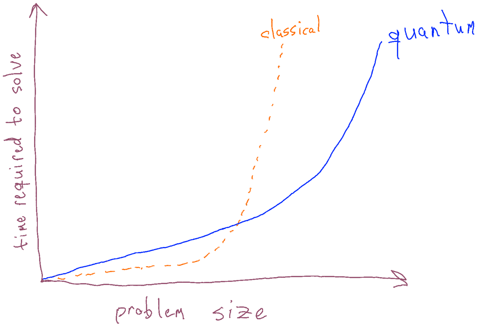

+++
title = "How to Explain What a Qubit Is"
date = "2023-07-14"

[taxonomies]
tags = ["quantum"]
+++

In keeping with my love of hot takes, let me skip straight to the end: if you're writing a popular news article about quantum computing, the best way to explain what a qubit is is to just... not do that.

As fun as dropping a Granade-signature hot take and running away is, let me unpack that a bit, though. Open up a random news article about quantum computing, and it will likely open up with some form of brief explanation about what quantum computing is. Normally that will start with a sentence or two about what qubits are, something along the lines of "qubits can be in zero and one at the same time. Besides being so radically untrue that I included it in my [quantum falsehoods](https://gist.github.com/cgranade/c2f447cc130574e9f7e5f33728b2566f) post from a few years ago as QF1002, it just isn't very helpful to someone reading a news article about some new advancement. It's a bit like insisting that any popular article about classical computers should start out with a description of TTL voltages. All fascinating stuff, but a two-sentence summary at the start of a story just isn't the right place to delve into it.

In particular, it doesn't give the reader what they need to know to put quantum computing news into context: what impact are they likely to have on society, what challenges might preclude that, who is building them, and how do their interests relate to the reader's own interests? That these are generally regarded as more specialized details means you get a never-ending parade of folks who think quantum computers can instantly solve hard problems (they can't; that
s QF1001), that quantum computers are faster classical computers (they aren't), or that quantum computers will be commercially viable in the next few years (they won't).

I'll offer that a much better way is to open with some version of this graph:

I sketched this (pretty badly, too, sorry; I'm much better at doing quantum stuff than I am at drawing) to indicate that it's really quite schematic. The particulars are very important, but depend on the kind of problem you're interested in — the shape of those curves depends **heavily** on the problem you want to talk about. For any problem that allows for a quantum advantage, though, you'll have a plot of that form, showing that for small enough problems, classical computers will still be faster, but as problems grow, quantum approaches look more and more appealing. As classical computers get better, that crossover point moves out, but critically, the overall shape is a property of the problem and the algorithm used to solve it, not of the specific devices used.

Right away, this kind of plot already tells the reader a few very important things:

- Quantum computers won't ever replace classical computers, since there will always be a range below that crossover point; that range gets bigger as classical computers improve and smaller as quantum devices improve, but will always be there in some form.
- Quantum computers aren't just faster classical computers, _and they don't need to be_. Even for quantum computers with very slow gate speeds, for problems that allow for a quantum advantage, there will always be a crossover point where that quantum device will win.
- The exact shape isn't just a property of the classical and quantum devices, but also of the problem being considered. Cryptography and material science questions will give you very different shapes, so readers caring about impacts on security and climate change research may take away very different impressions of how important quantum computers are.
- When we talk about quantum advantage, we're talking about large problems that take significantly more qubits than current devices. While some contrived problems have crossover points that strongly favor quantum devices even at small problem sizes, that's not generally applicable to practical problems — readers can't infer from advantage experiments alone how important quantum computers might be to them and the problems they care about.

It's not that it doesn't matter what a qubit is — it absolutely does — rather, it's not the right context readers need to make sense of the endless stream of excitement, hype, progress, and misinfo thrown into the blender of modern news feeds. It's much more important and useful to provide that context directly than to perpetuate the same falsehoods.
