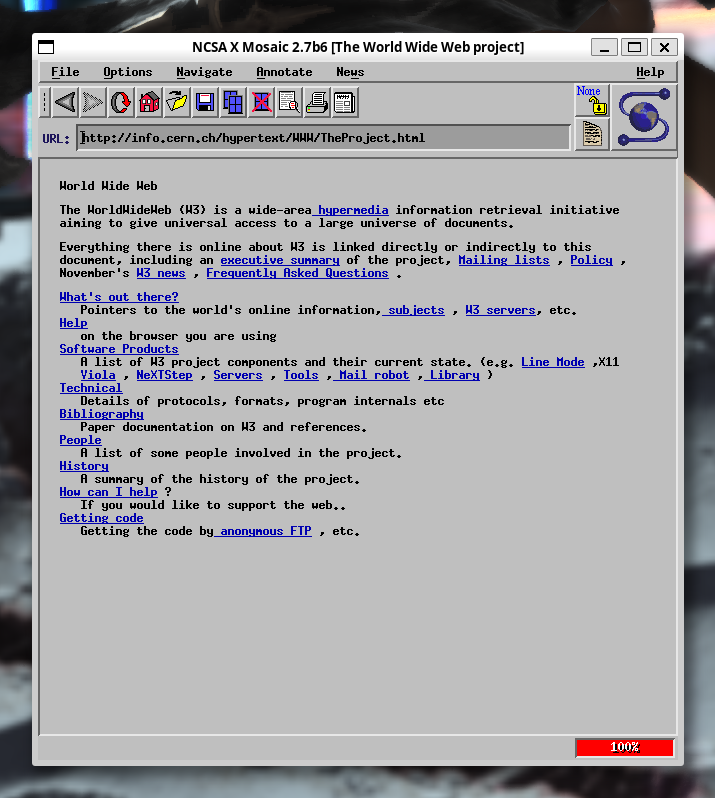
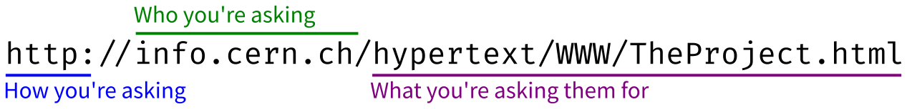

+++
title = "You Can't Program Quantum Computers With Python (Part I)"
date = 2023-08-18

[taxonomies]
tags = ["tech", "politics"]
+++

# A Progressive Case for the Fediverse

In today's newsletter, I'll lay out my case for why progressives should, as a matter of political principle, do the work needed to embrace and work to improve the fediverse. By necessity, making that argument cannot involve endorsing the fediverse in its current state as institutionalizing racism and other forms of hate, but rather this argument implores progressives to get involved, to build communities on the fediverse, and to do both the social and technical work needed to make those communities inclusive of all races, genders, orientations, and physical and mental disabilities.

At the same time, I also want to clarify that this argument is not intended to preclude the potential for building networks that are *more* consistent with progressive ideals than the fediverse. No honest expression of progressive ideals should ever posit a terminal state for societal improvement; we are a flawed society, and the nature of progressivism is to continually improve society to redress those flaws. Rather, I would argue that the fediverse in its current form is a baseline for what a progressive view of the internet should be: a flawed and problematic thing but that can be improved at a structural level through political and community organizing.

My argument will also necessarily involve some degree of technical jargon. While this argument is not a technological argument, and is not intended to be read exclusively by technical experts, it is absolutely and unavoidably true that technology is increasingly the lever used by capital to enact societal change. Understanding that fulcrum is essential; to borrow and rather mangle a phrase from [Nora Tindall](https://tenforward.social/@noracodes/110894156391390911), progressiveism does not demand that you need to be able to repair your car, but it does require you to understand that it burns fossil fuels. Similarly, some level of jargon is necessary as a matter not of political rather than technical literacy.

I also need to stress that this is not a how-to guide in any form. It's a polemic, a political argument, and hopefully a well-reasoned rant, but it isn't a tutorial. For that, I highly recommend [Kat's Mastodon Quickstart for Twitter Users](https://dev.to/zkat/kat-s-mastodon-quickstart-for-twitter-users-39db) by [zkat](https://toot.cat/@zkat).

Finally, I want to deeply thank [Sarah Kaiser](https://mathstodon.xyz/@crazy4pi314/) and [Nora Tindall](https://tenforward.social/@noracodes) for feedback on drafts of this post.

## Progress as Durable Improvement

With those clarifications in place, it's worth starting by expressing what we demand out of any progressive approach to social media. I posit that as progressives, we should demand no less than we do in any other political arena: durable improvements to society that work at a structural level to preclude injustice in the future. Whereas liberalism tends towards fixing problems in a symptomatic way, perhaps by the allocation of aid packages, tax credits, and other targeted action, progressive politics generally demands that immediate fixes are paired with structural changes that will help prevent the same or similar problems from occurring in the future. To approximate nearly to the point of mutilation, liberals are concerned with winning elections, while progressives are concerned with expanding voting rights. Liberals want to fire bad cops, progressives want to reduce police budgets and keep military-grade weaponry out of law enforcement hands. Liberals want to offer free bus fare to low-income riders, progressives want car subsidies to be applied to public transit instead.

Liberals and progressives tend to agree that it is bad to post to Truth Social, Parler, Gab, or other right-wing Twitter clones, but it's what comes next that separates the two philosophies.
Liberals want to replace Twitter with a corporate social media platform run by good billionaires, progressives should want to build something better.

## The Core Problem of Centralized Media

To build something better than the next Twitter requires understanding what went wrong with Twitter at a deeper level than what generally fits in, well, a single tweet. It's tempting to say that the problem with Twitter was that it was bought out by the richest man on the planet, and that said man is a [virulent transphobe](https://techcrunch.com/2023/06/21/elon-musk-triples-down-on-making-twitter-terrible-for-trans-people/), a [COVID-19 denier](https://www.cnbc.com/2022/11/29/twitter-stops-policing-covid-19-misinformation-under-ceo-elon-musk.html), a fierce [opponent of labor rights](https://www.businessinsider.com/elon-musk-tesla-nlrb-labor-law-violations-tweet-retalition-rehire-2021-3?op=1), and [a right-wing operative who helped launch DeSantis' campaign](https://www.nbcnews.com/politics/2024-election/ron-desantis-presidential-bid-campaign-elon-musk-rcna85288). All of these are true, and liberal political philosophy would be right to focus on these as problems that require a response. It is true that Elon Musk has turned Twitter into a fairly explicit right-wing disinformation network, but progressive political philosophy both invites us to and demands that we understand that to be symptomatic of deeper structural problems.

In particular, and I cannot emphasize this enough, **the problem is that a single person can simply buy a significant fraction of all human communication**. Progressive politics does not generally oppose corporate interests as a matter of aesthetics or us-versus-them sort of thinking, but as a recognition that centralized control of social organizations by unaccountable bodies is in general somewhere between bad and catastrophic. Privatization of public utilities is bad because they allow centralized control over the pricing and availability of basic infrastructure. Monopolies are bad because centralized control over markets creates wildly unjust economic inequality. Centralized social media is bad because it allows a small number of unaccountable owners to dictate how people communicate and advocate for their values.

That Twitter was bought out by a particularly egregious asshole makes the problem obvious and urgent, but it neither started with nor ends with him.

## Interoperability as Robustness

To a progressive, structure matters, so to understand what went wrong with Twitter, let's rewind back to when the Internet was structured very differently. (Here is where the technical jargon comes in, by the way. I promise that it's as minimal as I can make it while still staying true to my own progressive politics.) To browse the Web in 1993, you might do something like launch [NCSA Mosaic](https://en.wikipedia.org/wiki/Mosaic_(web_browser)), an early Web browser. You might then type something into the address bar (labeled "URL" in Mosaic) like `http://info.cern.ch/hypertext/WWW/TheProject.html`, and press Enter. 

With the magic of the early-90s Internet, you'd have then gotten a window very much like the one above. To do that, your computer would have used the address you provided to make a _request_ to another computer somewhere else on the Internet. A computer that is configured to reply to that kind of request is called a _server_; back then, many servers were the same kind of computer you might have on your own desktop, with nothing especially fancy about them.

Each address tells your browser three distinct things: how to ask the other computer for your page, what computer to ask, and what page to ask them for.

The first part, how to ask them, is sometimes known as the _protocol_, and is key to what makes the Internet what it is. Your computer and the server may be made by different companies, may run different software, may have been made at different times, and so forth, but they can still talk to each other because both sides have agreed to speak the same protocol. Today, almost everything goes through either the HTTP or HTTPS protocols, so this part of the address is slightly redundant, but it's nonetheless critical to allowing your browser to talk to whatever other website it wants _even if that server doesn't know anything about your computer_.

Next, your browser back then could talk to any server that was available on the Internet. Universities, municipal governments, Internet service providers, and other organizations may each have made their pages available on servers that they owned and controlled, so you needed a way to tell your browser what computer to talk to. The details are complicated and kind of besides the point, but computers that want to serve things on the Internet are generally given names; in this example, `info.cern.ch`. Your browser can use that name to look up what server to talk to, again not needing to know any other details about that server.

Finally, the last part of that address specifies what you want that server to give you. This part is generally up to the server, and acts as the name of a specific page on that server.

Each part of that address exists because, above all else, the early Internet was _interoperable_. Your computer and whatever other servers you wanted to talk to didn't have to share anything beyond a basic agreement about what protocol to use and how to look up names. Both of those were owned by standards bodies, such that anyone could make a new browser or new server software without having to ask anyone for permission, and without having to update everything else on the Internet.

There were some bitter, bitter fights to make the Internet less interoperable, but that speaks to the immense importance of interoperability as a progressive value: at a technical level, it prevents any single piece of software from precluding any other software from working. At a social level, that guarantees that a single company cannot control what is and isn't allowed on the Internet.

## Web 1.9

Somewhere along the way, though, things changed. Servers had to get bigger and bigger to handle all the new computers on the Internet making requests, pages got more and more complex instead of just having text and some occasional images, companies offering stuff on the Internet got bigger and bigger, and most browsers are effectively made by Google. Now, if you look at your address bar in Chrome, Safari, Firefox, Edge, or whatever else, you might see something like `https://twitter.com/cgranade/status/1643684152280231936`. That address breaks down in exactly the same way as before, telling us that our browser used the HTTPS protocol to ask Twitter for a specific tweet that I wrote.

The trouble is, _every_ tweet will have an address that's not too much different than that. Back in the 90s, if you wanted to learn about particle colliders, you'd go to `cern.ch`, and if you wanted to learn about your local city government, you might go to something like `seattle.gov`.

Increasingly, though, you might go to `https://twitter.com/CERN` or `https://twitter.com/CityOfSeattle`. In both cases, your computer has to ask `twitter.com` **and only** `twitter.com` for what is at that address. Whomever owns `twitter.com` can decide on everything your computer knows and sees about Twitter as a social media service. Musk buying the company that owned that one, single server (made up of untold numbers of actual servers all owned or rented by Twitter and working together to pretend to be a single server when talking to your computer) was enough to take control of all communication that happened on Twitter. Here, we come again to the progressive idea that it's not enough to respond to Musk by trusting all our communications to a different single server that can be bought out by a single other billionaire, but that we must instead go even deeper to understand how we got to this point in the first place, and what we can do better at a structural level going forward.

Much of the centralization of the Internet started happening with a set of technologies that collectively became known as "Web 2.0," allowing pages to act more like software in their own right, such that `twitter.com` isn't only the name of a server giving you different pages, but also an entire software application for interacting with those pages. Unlike the early 90s Web, your browser no longer gets pages from different servers, it gets software that often can only interact with specific servers.

The situation is even worse on phones and other kinds of embedded devices like game consoles, smart TVs, and so forth. If something has a Twitter app, that is software that can only talk to `twitter.com`; even your browser can still at least ask for software from other servers like `facebook.com`, but a Twitter app will never let you look at Facebook.

It didn't have to be that way, of course. We could have had a wonderful Web 1.9; all the nice new technology to expand what the Web can be without narrowing it down to a scant few servers controlled by an even smaller cluster of companies. Interoperability isn't enough to break down control over social media on the Web, though. After all, `twitter.com` is still delivered to your computer using protocols like HTTPS. While interoperability may allow for new software and new sites to participate in the Internet, it doesn't on its own guarantee that new _users_ can participate without their words and images being owned, controlled, and moderated by a single unaccountable party. For that, to really realize a progressive vision for what the Web could be, we need to go beyond interoperability to _federation_.

## Federation as Consent

Interoperability has always been important to the Web, but as progressives we need to look at how interoperability didn't protect against centralized control over how users interact with the Web. Interoperability on its own was far more about preventing any one software vendor from building a monopoly, but it doesn't at all preclude one social media platform from controlling communication and bending it to serve explicit right-wing causes.

I posit that the problem is that while interoperability focuses on a dichotomy between users as consumers and servers as publishers, that's not how most people use social media. Rather, people use social media to be, well, social; to talk to other users. On social media, you don't just read what other people have written, you build up lists of whose writing you'd like to read and even post your own. Interoperability between various kinds of software on its own doesn't guarantee that if you post to one server, another user can read it from a different server.

To achieve that, different servers need to talk to each other using an interoperable protocol; we generally call this kind of interoperability _federation_. If that all sounds a bit arcane, this is precisely how e-mail works. If you log into GMail and write an e-mail to my consulting company at `cgranade@dual-space.solutions`, that address isn't just how you find a server, but rather refers to a particular user on that server. The server at `gmail.com` uses that information to find `dual-space.solutions` and deliver your message to the user `cgranade`, allowing us to communicate with each other even though I don't use GMail.

From a progressive standpoint, that last part is critical: your use of GMail, Outlook.com, or whatever other e-mail service doesn't apply any pressure for me to use the same service provider. In particular, I don't use GMail for privacy reasons, and so the fact that e-mail is a federated protocol means that my boundaries around privacy and security are better respected than if I needed to use the same e-mail server in order to communicate with you.

That's not merely theoretical, either. If you want to text someone, there's a dance that's almost rote by this point, working out whether to use Twitter DMs, Discord messages, Facebook Messenger, [Signal](https://signal.org/), or whatever else. Each of those services requires that you communicate only with other users on the same service. While you can send me an e-mail from GMail, you cannot send me a text from Facebook Messenger. ([Matrix](https://matrix.org/) is, however, is federated in a similar way to e-mail, but that's somewhat beyond the scope of this post.)

Thinking to a progressive response to the right-wing takeover of Twitter, then, a social media platform that is robust to future right-wing takeovers is one that is _both_ interoperable and federated. Thankfully, such a platform exists, and has existed since about 2017: the _fediverse_.

Perhaps a silly name (though arguably no sillier than the early-00s "blogosphere"), but the term refers to the loose network of social media servers that communicate with each other using a protocol known as ActivityPub — the choice of server-to-server protocol is irrelevant if you're posting to the fediverse or reading someone else's posts, just as it's irrelevant to e-mail that servers communicate with each other using a protocol known as SMTP. Rather, what matters is that if you're using `mathstodon.xyz` to read my social media posts, you can ask `mathstodon.xyz` to follow `@xgranade@wandering.shop`, causing the server at `mathstodon.xyz` to communicate with the server at `wandering.shop`. Just as with e-mail, we don't need to use the same server to communicate and share posts with each other.

Servers that participate in the fediverse this way (sometimes called _instances_), can be powered by any number of different software packages. An instance can use Mastodon to offer a Twitter-style social media feed, but users of that instance can follow users not just on other instances running Mastodon, but also Pixelfed, Calckey, GoTo Social, Lemmy, KBin, Bookwyrm and other kinds of instances.

Critically, though, that federation is not unlimited or without restrictions. In order for federation to respect consent, servers must also be able to _refuse_ to federate with other servers on a case-by-case basis. If a server is only used for sending spam, I can make sure that my own server blocks it. In the social media context, an instance that hosts Nazi content should not be allowed to federate with other instances. Blocking another instance this way is called _defederation_, and is as much an expression of community boundaries and a proactive consent culture as it is when you block accounts from your own account.

## What Do You Need to Do?

If this all sounds complicated, let me once again appeal to progressive values, but in a more crass way this time: it fucking should be. This, by the way, is where we get to the fossil fuel part of the analogy that I borrowed at the start of the piece. The modern Web did not become simple by eliminating technical complexity, but by consolidating ownership. While a Mastodon instance like `wandering.shop` or `mathstodon.xyz` can participate in the fediverse with any other instance that talks using ActivityPub, Mastodon-powered or not, `twitter.com` runs Twitter, is owned by Twitter, can only be used in the Twitter app or from `twitter.com`, and talks only to Twitter. That's not simplicity, it's a monopoly.

Just as with the dominance of car culture over public transit has severe implications for climate change, that monopoly has drastic and horrifying consequences for progressive causes. The Internet and the Web are extremely powerful tools, to put it mildly. They have enabled entire generations of queer people to find each other, but they have also led directly to literal genocide. They allow for progressive organization and advocacy at unprecedented scales, but also have enabled the incredible escalation in fascism embodied in Trump's and DeSantis' campaigns and policies. We don't get the good uses of the Internet without challenging the monopolistic structures that underpin so much of the modern Web.

Progressivism is about action, though, and thus demands that we do the work to understand that complexity — the same complexity hidden by coercive monopolies — so that our tools don't once again become tools of right-wing reactionaries.

That's necessary but not sufficient, of course. The structure of the fediverse is a structure that helps resist right-wing takeover and control of communication, but it on its own isn't sufficient to realize other progressive values, _especially_ antiracism ([to wit](https://hachyderm.io/@mekkaokereke/110273797004251326)). Thus, progressivism has a few more demands to make of us. We need to advocate for better moderation policies on instances that we use and interact with. We need to raise awareness of where the fediverse isn't living up to what we need it to be. We need to sponsor efforts to make the fediverse better, more inclusive, and less hateful. We need to listen when people tell us we're not meeting that goal.

Perhaps, most of all, I strongly believe progressivism demands that we do not shut the fuck up. We need to be loud about why the fediverse is necessary, why making it better is necessary, what goes wrong with centralized social media, and most of all, what we can do together to truly make a progressive ideal of social media work.
